# 🏗️ Azure Project Ecosystem — Lockton Brasil

This document details the **30 repositories** comprising the ecosystem, explaining the functionality of each project, their dependency relationships, and the macro architectural view.

---

## 📐 Architecture Overview

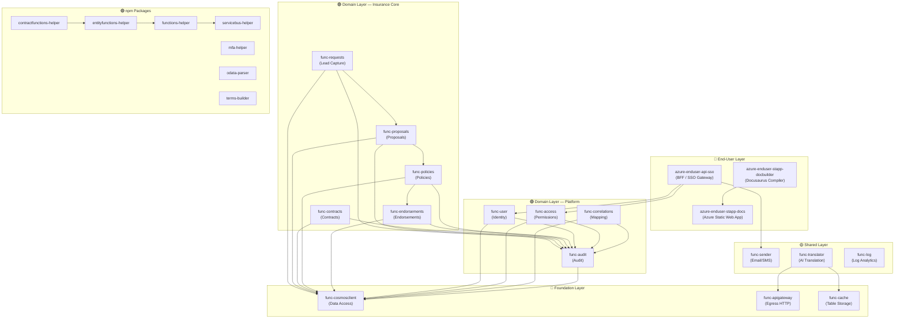

---

## 🔗 Package Dependency Graph

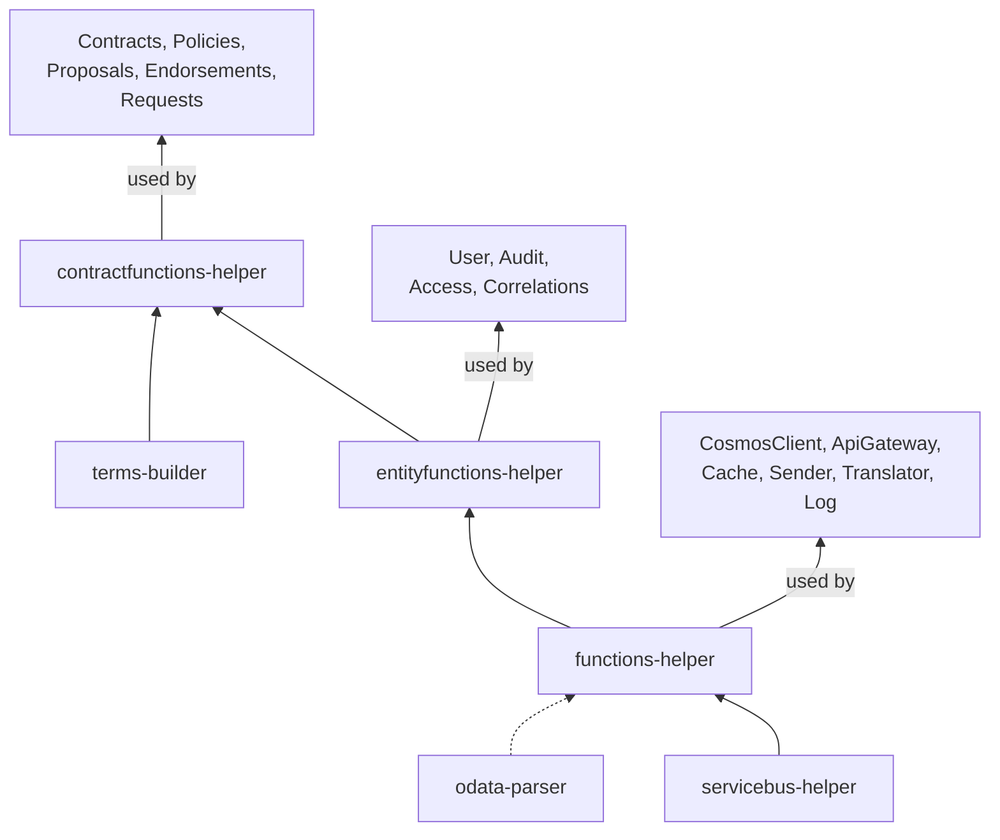

---

## 🔄 Business Flow: Insurance Lifecycle

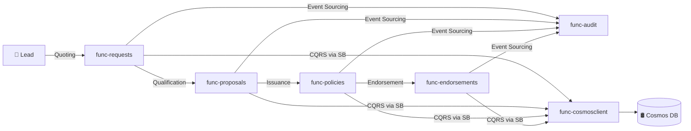

**Pipeline Status:** `Pending → Quoted → Proposal → Policy Issued → Endorsed`

---

## 📊 Project Inventory (30 repositories)

### 🟢 Domain Functions (10 projects)

| # | Project | Responsibility | Helper | Service Bus Queues |
| --- | --- | --- | --- | --- |
| 1 | `azure-domain-func-access` | Environments, Apps, and Access Permissions | EntityFunctions | `environment*`, `system*`, `access*` |
| 2 | `azure-domain-func-audit` | Centralized Auditing (Terminal Sink) | EntityFunctions | `audit` (single ingress) |
| 3 | `azure-domain-func-contracts` | Insurance Contracts + Dynamic Terms | ContractFunctions | `contracts*` |
| 4 | `azure-domain-func-correlations` | Value mapping/Cross-reference between entities | EntityFunctions | `correlations*` |
| 5 | `azure-domain-func-endorsements` | Endorsements (alterations to in-force policies) | ContractFunctions | `endorsements*` |
| 6 | `azure-domain-func-policies` | Insurance Policies (issuance + in-force term) | ContractFunctions | `policies*` |
| 7 | `azure-domain-func-proposals` | Pre-issuance proposals | ContractFunctions | `proposals*` |
| 8 | `azure-domain-func-requests` | Quote Requests (Leads) | ContractFunctions | `requests*` |
| 9 | `azure-domain-func-user` | Identity Management + Authentication | EntityFunctions | `user*` |
| 10 | `azure-domain-func-template` | Boilerplate for new domains | EntityFunctions | — |

---

### 🔷 Foundation Functions (4 projects)

| # | Project | Responsibility | Key Dependencies |
| --- | --- | --- | --- |
| 11 | `azure-foundation-func-cosmosclient` | Centralized Cosmos DB access (CQRS) | `@azure/cosmos`, `functions-helper` |
| 12 | `azure-foundation-func-apigateway` | HTTP Proxy for external APIs (Egress) | `axios`, `functions-helper` |
| 13 | `azure-foundation-func-cache` | Distributed KV Cache + TTL (Table Storage) | `@azure/data-tables`, `functions-helper` |
| 14 | `azure-foundation-func-template` | Boilerplate for new Foundation services | `functions-helper` |

---

### 🟡 Shared Services (4 projects)

| # | Project | Responsibility | Queues |
| --- | --- | --- | --- |
| 15 | `azure-shared-func-sender` | Email and SMS delivery (Azure Communication Services) | `senderemail`, `sendersms` |
| 16 | `azure-shared-func-translator` | AI Translation + Smart Caching | `translate` |
| 17 | `azure-shared-func-log` | KQL Queries in Log Analytics (Managed Identity) | `logquery` |
| 18 | `azure-shared-func-odata` | ⚠️ Empty project (absorbed by the `odata-parser` package) | — |

---

### 🟣 Packages / Libraries (7 projects)

| # | npm Package | Type | Role |
| --- | --- | --- | --- |
| 19 | `azure-packages-functions-helper` | Base Framework | Standardized Orchestrators, Activities, and HTTP triggers |
| 20 | `azure-packages-entityfunctions-helper` | CRUD Factory | Automatically generates 4 orchestrators (Upsert, Read, Query, Delete) with Zod + Audit |
| 21 | `azure-packages-contractfunctions-helper` | CRUD Factory + Terms | Extends EntityFunctions with dynamic Terms validation by line of business |
| 22 | `azure-packages-servicebus-helper` | SDK Wrapper | Abstracts Azure Service Bus (send, receive, queue management, batch, DLQ) |
| 23 | `azure-packages-mfa-helper` | Security Library | MFA generation/validation (SHA-512 + `timingSafeEqual`) |
| 24 | `azure-packages-odata-parser` | Query Parser | Converts OData `$filter` → Cosmos DB SQL |
| 25 | `azure-packages-terms-builder` | Schema Registry | Dynamic Zod schemas per insurance line of business |

---

### 🔵 End-User Applications (3 projects)

| # | Project | Type | Role |
| --- | --- | --- | --- |
| 26 | `azure-enduser-api-sso` | BFF / Gateway | Orchestrates SSO (Azure AD / Entra ID) → domain functions |
| 27 | `azure-enduser-stapp-docbuilder` | Docusaurus 3 Compiler | Synchronizes READMEs → interactive documentation with ApiTester |
| 28 | `azure-enduser-stapp-docs` | Deployment (SWA) | Hosts static builds on Azure Static Web Apps |

---

### 🧪 Testing and Utilities (2 projects)

| # | Project | Type | Role |
| --- | --- | --- | --- |
| 29 | `azure-shared-tests-e2e` | E2E Suite | Tests full-journey flows (User → Proposal → Policy) |
| 30 | `project-utils` | Scripts | Maintenance automation (`npm-cleanup-reinstall.bat`) |

---

## 📋 Project Detailed Breakdown

### 1. azure-packages-servicebus-helper

**Type:** Library (Helper Package)

**Description:** Simplified wrapper for Azure Service Bus operations.

**Tech Stack:** Node.js, JavaScript, @azure/service-bus

**Responsibilities:**

* Simplifies message publishing (individual and batch).
* Simplifies message consumption using handlers.
* Manages connection pooling and logging (integrated with Azure Functions context).
* Automatic JSON serialization.
* Programmatic queue management and creation (Dead-Letter, batch, purge, stats).
* Automatic retries with exponential backoff.

### 2. azure-packages-functions-helper

**Type:** Framework/Library

**Description:** Framework for the orchestration and standardization of Azure Durable Functions.

**Tech Stack:** Node.js, Azure Functions, Durable Functions

**Responsibilities:**

* Abstraction layer for orchestrators and activities.
* Implementation of the asynchronous Request-Reply pattern over Service Bus.
* Automatic exposure of HTTP endpoints to trigger orchestrations.
* Automated `correlationId` propagation and standardized logging.
* Defines `MainOrchestrator` as a dynamic entry point.

### 3. azure-packages-entityfunctions-helper

**Type:** Factory/CRUD Generator

**Description:** Facilitates the creation of CRUD microservices using Durable Functions.

**Tech Stack:** Node.js, Durable Functions

**Responsibilities:**

* The `createCRUDOrchestrations` method automatically generates Upsert, Read, Query, and Delete orchestrators.
* Out-of-the-box integration with DbClient and Audit queues.
* Schema validation (Zod compatible).
* Automatic UUID generation and concurrency control via ETags.
* Customizable hooks (`beforeUpsert`, `afterUpsert`).

### 4. azure-foundation-func-cosmosclient

**Type:** Foundation Microservice (Data Access Layer)

**Description:** Centralizes data access to Azure Cosmos DB.

**Tech Stack:** Azure Functions, Cosmos DB SDK, Service Bus

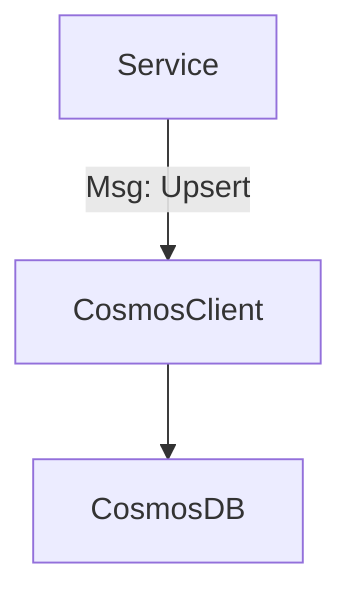

**Responsibilities:**

* Exposes CRUD operations via Service Bus queues (`cosmosclientupsert`, `cosmosclientread`, `cosmosclientquery`, `cosmosclientdelete`).
* Ingress schema validation.
* Error handling for Cosmos-specific status codes (409 Conflict, 412 Precondition Failed, 429 Too Many Requests).
* Singleton connection management and Backpressure/Throttling handling.

### 5. azure-domain-func-audit

**Type:** Domain Microservice (Core Compliance)

**Description:** Manages the lifecycle of audit logs.

**Tech Stack:** Azure Functions, EntityFunctionsHelper

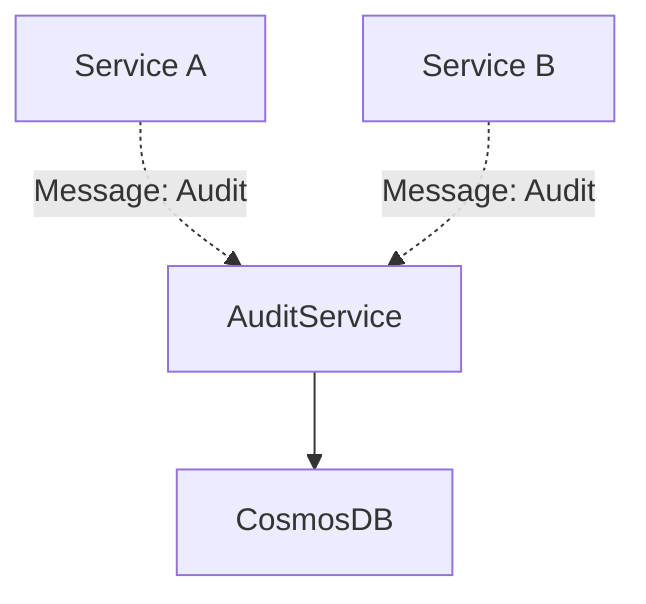

**Responsibilities:**

* Consumes audit queues (by implementing a CRUD factory for the `audit` table).
* Enriches log entries with timestamps, `userId`, and `appId` before persistence.
* Acts as a Terminal Sink receiving events from **all** other services.
* Records immutable deltas (Event Sourcing).

### 6. azure-domain-func-user

**Type:** Domain Microservice

**Description:** Manages user data with built-in security and auditing.

**Tech Stack:** Azure Functions, Bcrypt, EntityFunctionsHelper

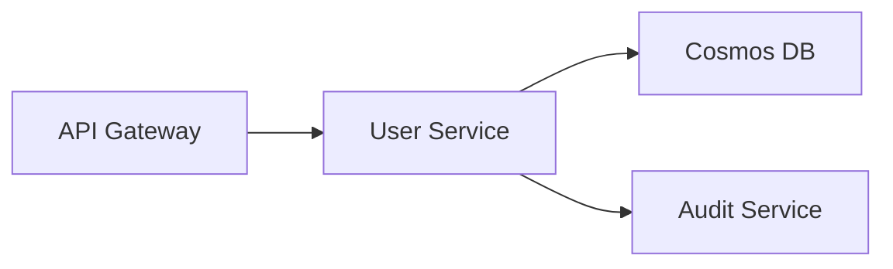

**Responsibilities:**

* User CRUD management (via `EntityFunctionsHelper`).
* Password hashing using bcrypt during upsert operations.
* Email normalization (lowercase mutation).
* Masking of sensitive fields (`password`, `passwordHash`) on read operations.
* Asynchronous login authentication via a dedicated orchestrator.
* Auditing enabled by default.

### 7. azure-domain-func-access

**Type:** Domain Microservice

**Description:** Manages environments, applications, user profiles, and granular permission mapping (Roles/Policies) within the identity ecosystem.

**Tech Stack:** Azure Functions, EntityFunctionsHelper

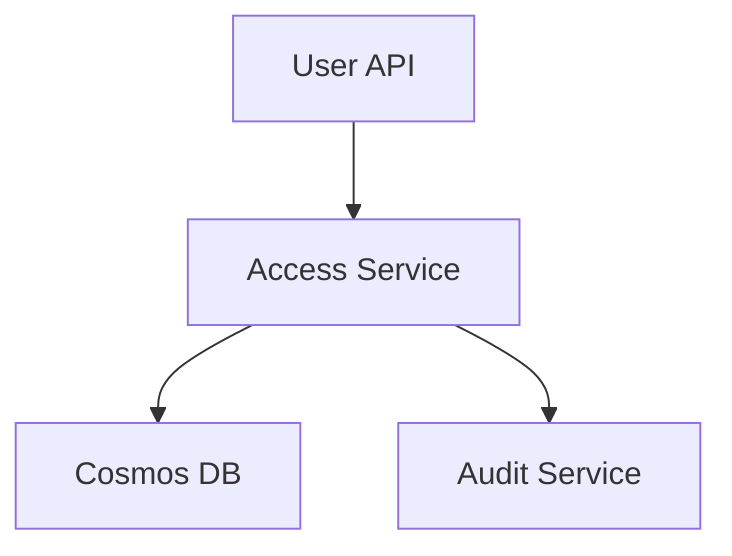

**Responsibilities:**

* Enforces RBAC resources driven by Dynamic Rules.
* Dedicated operational control queues: `environmentupsert`, `systemquery`, `accessdelete`.
* Permission grant expansion leveraging EntityFunctions.

### 8. azure-domain-func-template

**Type:** Template

**Description:** Base boilerplate project for spin-up of new entity microservices.

**Tech Stack:** Azure Functions, EntityFunctionsHelper

**Responsibilities:**

* Reference CRUD implementation.
* Standardized starting point for new microservices.
* Fixed structural scaffolding: `src/functions/` (Triggers), `src/package/` (Schemas), `tests/unit/` (Jest).

### 8. azure-foundation-func-apigateway

**Type:** Foundation Microservice (Egress Gateway)

**Description:** Centralizes outbound external HTTP calls.

**Tech Stack:** Azure Functions, Axios, FunctionsHelper

**Responsibilities:**

* Orcreates and executes HTTP requests directed to external services.
* Standardizes logging, Application Insights telemetry, and outbound headers.
* Built-in resilience with time-based Timeouts and Retries.
* Input queue: `apigateway`.

### 9. azure-foundation-func-cache

**Type:** Foundation Microservice (Cache)

**Description:** Distributed caching service backed by Azure Table Storage.

**Tech Stack:** Azure Functions, Azure Table Storage, FunctionsHelper

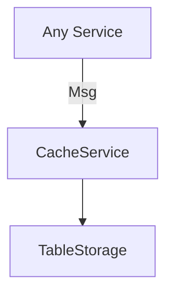

**Responsibilities:**

* Persists key-value pairs (`PartitionKey`, `RowKey`, `Value`) with native TTL enforcement.
* Lazy Expiration mechanism to purge residual data.
* Input queues: `cacheupsert`, `cacheget`, `cachedelete`.

### 10. azure-foundation-func-template

**Type:** Template

**Description:** Baseline template for crafting Foundation microservices.

**Tech Stack:** Azure Functions, FunctionsHelper, LoggerHelper

**Differences from Domain Template:**

* Tailored for utility processing (does not assume or include EntityFunctionsHelper).
* Out-of-the-box support for generic functions, timer triggers, or stream processing.

### 11. azure-shared-func-translator

**Type:** Shared Microservice (Utility)

**Description:** Text translation engine enhanced with smart caching.

**Tech Stack:** Azure Functions, Azure AI Translator, Table Storage (cache)

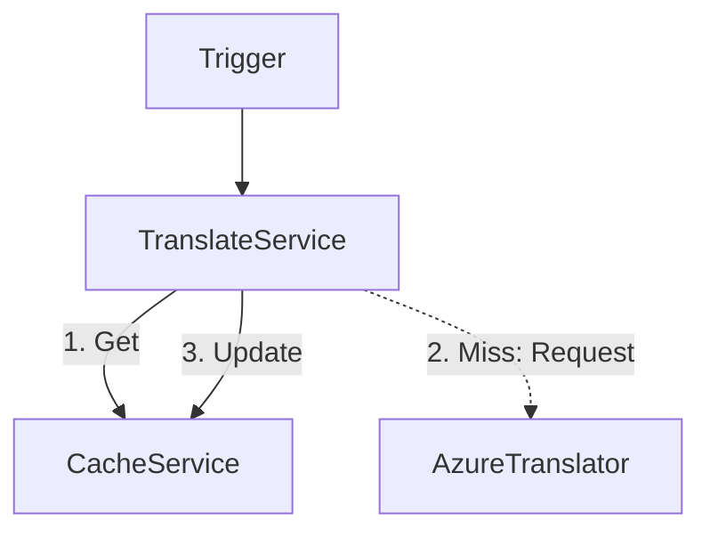

**Responsibilities:**

* Translates strings via Azure AI Translator.
* Cache-Aside Pattern: checks cache → on miss, queries API → populates cache.
* Mitigates API costs by eliminating duplicate translation queries.

### 12. azure-shared-func-sender

**Type:** Shared Microservice (Utility)

**Description:** Centralizes outbound Email and SMS transmissions via Azure Communication Services.

**Tech Stack:** Azure Functions, ACS (Email/SMS), FunctionsHelper

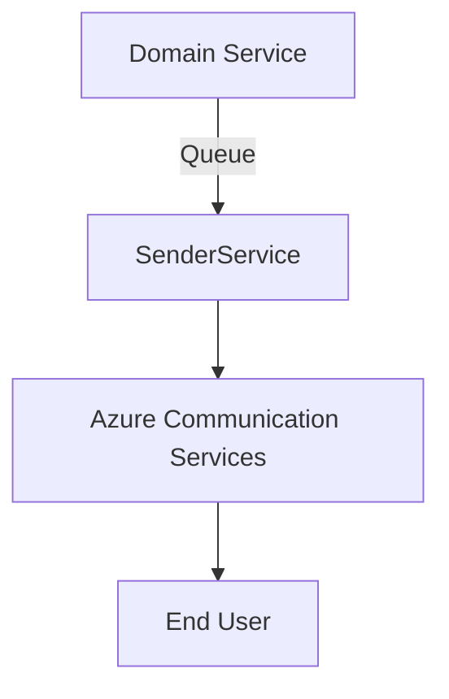

**Responsibilities:**

* Dispatches emails supporting HTML Templates and base64 encoded attachments.
* Instantly transmits transactional SMS.
* Handles Rate-Limiting constraints via queue patterns (absorbs traffic spikes from mass campaigns).
* Input queues: `senderemail`, `sendersms`.

### 13. azure-shared-func-log

**Type:** Shared Microservice (Observability)

**Description:** Centralized gateway for querying logs within Log Analytics.

**Tech Stack:** Azure Functions, Azure Monitor Query Logs, Managed Identity

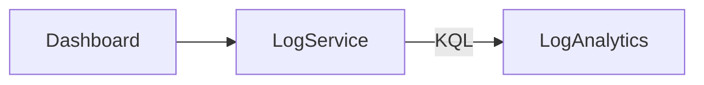

**Responsibilities:**

* Centralized log querying via KQL (Kusto Query Language).
* Utilizes Azure AD Managed Identity for secure access (zero Workspace ID exposures).
* Input queue: `logquery`.

### 14. azure-shared-tests-e2e

**Type:** Testing Suite

**Description:** Centralized testing harness for ecosystem integration and E2E validation.

**Tech Stack:** Jest, Axios, Child Process

**Responsibilities:**

* Validates full end-to-end user flows (User → Proposal → Policy).
* Automates environment bootstrapping and service testing scripts.
* Architecture: `tests/integration` (service pairs) and `tests/e2e` (complete user journeys).

### 15. project-utils

**Type:** Automation Scripts & Tools

**Description:** Centralized collection of PowerShell and Node.js maintenance scripts for workspace enforcement and monorepo orchestration.

**Knowledge Base:** Relies on `settings/projects.json` as the *Single Source of Truth* mapping metadata for all active projects, detailing project types (`function`, `package`), stacks (`node`, `dotnet`), and available scripts.

**Core Scripts (`/scripts/`):**

* **⚙️ Code Quality & Linting Automation:**
* `npm-lint-all.ps1`: Executes native `npm run lint` sequences across repositories parsed from `projects.json`. Supports execution parameters like `-Fix` (autocorrection) and `-StopOnFail`.
* `npm-cleanup-reinstall.ps1`: Purges `node_modules` folders systematically, flushes system level caches, and recreates symlinks with updated dependencies via `npm i`.

* **☁️ Infrastructure & GitHub Actions Automation:**
* `git-commit-push-all.ps1`: Triggers unified `git add .`, commits, and pushes upstream across all targets mapped in `projects.json`, starting up 25 deployment pipelines simultaneously.

---

## 🆕 Insurance Core Domain Additions

### 16. azure-packages-contractfunctions-helper

**Type:** Library (Specialized Extension)

**Description:** Extension of `entityfunctions-helper` specialized for Insurance Contracts and Policies.

**Tech Stack:** EntityFunctionsHelper, TermsBuilder

**Responsibilities:**

* Inherits all core CRUD mechanics from `entityfunctions-helper`.
* **Injects Contractual Terms Validation**: Intercepts pipeline execution with a `validateTerms` activity that dynamically verifies policy payload constraints against the respective Insurance Line of Business.

### 17. azure-packages-terms-builder

**Type:** Library (Schema Registry)

**Description:** Central provider for dynamic domain validation schemas.

**Tech Stack:** Zod, JavaScript

**Responsibilities:**

* `getTermsSchema(key)`: Returns the appropriate Zod verification schema mapping to a product code (e.g., "Auto", "Life").
* Supports hierarchical schema inheritance resolution (e.g., "Term-Life" → "Life" → "Base").

### 18. azure-packages-odata-parser

**Type:** Library (Parser)

**Description:** Utility converting OData URL query strings into parameterized Cosmos DB SQL syntax.

**Responsibilities:**

* Allows endpoints to seamlessly ingest complex filter criteria (`$filter`, `$orderby`, `$select`, `$top/$skip`) through the URI.
* Translates URL strings into sanitized, injection-safe database queries.

### 19. azure-packages-mfa-helper

**Type:** Library (Security)

**Description:** Handles generation, hashing, and validation of Multi-Factor Authentication (MFA) tokens.

**Tech Stack:** Node.js crypto (Native)

**Responsibilities:**

* `generateMfaCode(digits?)`: Generates cryptographically secure random numeric tokens.
* `hashMfaCode(code)`: Applies SHA-512 hashing for secure token persistence.
* `validateMfaCode(code, hash, expiresAt)`: Compares tokens using `timingSafeEqual` to prevent side-channel timing attacks.
* `generateExpiry(minutes?)`: Computes token expiration timestamps.
* Zero external package dependencies for cryptographic safety.

### 20. Insurance Domain Services

**Projects:**

* `azure-domain-func-contracts` — Insurance Contracts
* `azure-domain-func-policies` — Policies (Inherits from Contracts)
* `azure-domain-func-proposals` — Pre-issuance Proposals
* `azure-domain-func-endorsements` — Endorsements (Mid-term Policy Adjustments)
* `azure-domain-func-requests` — Quote Requests (Leads)
* `azure-domain-func-correlations` — Cross-reference mappings between system entities

**Type:** Domain Microservices

**Pattern:** Driven by the **Contract Functions Pattern**.

**Description:** Core engines powering insurance business operations. They leverage `contractfunctions-helper` to ensure that beyond basic entity CRUD validation, insurance rules specific to the line of business (Terms) are strictly validated during any Upsert operation. The landscape follows a precise lifecycle sequence: Request → Proposal → Policy → Endorsement.

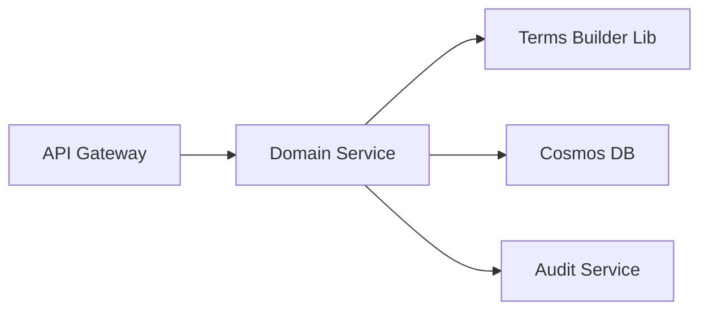

### 21. azure-enduser-api-sso

**Type:** BFF / Gateway (End-User Facing)

**Description:** Ingress integration API wrapper for the Lockton Single Sign-On engine.

**Tech Stack:** Node.js, Azure AD / Entra ID

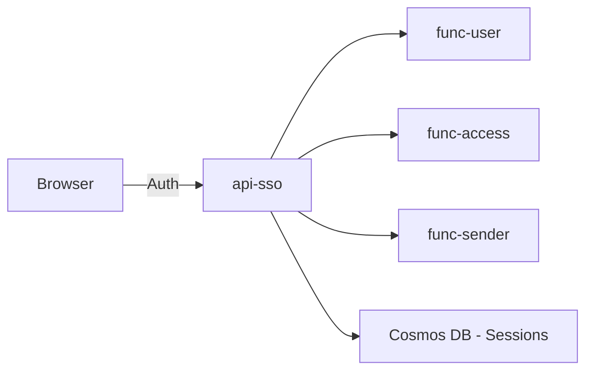

**Responsibilities:**

* Coordinates secure external HTTP input and hands off asynchronous back-end processing.
* **UserClient / AccessClient**: Dispatches HTTP operations bolstered with resilience policies (Polly).
* **SenderClient**: Offloads transactional alerts through Service Bus isolation.
* **Session/Password Repos**: Native management of data eviction leveraging Cosmos DB TTL features.

### 22. azure-enduser-stapp-docbuilder

**Type:** Documentation Engine

**Description:** Scaffolding utilizing Docusaurus 3 + React 18 for rendering interactive architecture documentation.

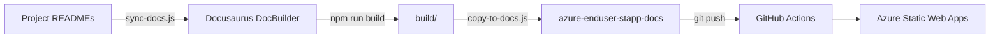

**Responsibilities:**

* `sync-docs.js`: Automatically crawls and extracts Markdown README documents from every workspace folder.
* `<ApiTester>`: Custom React/MDX component acting as an embedded client/Postman emulator directly inside web views.
* Offline searching features driven by `docusaurus-search-local`.

### 23. azure-enduser-stapp-docs

**Type:** Deployment Target (Azure Static Web Apps)

**Description:** Target hosting web deployment containing solely compiled asset bundles.

**Rule:** Strictly never modified manually. Code updates are exclusively provisioned through automation generated by `docbuilder`.

---

## 🏛️ Identified Architectural Patterns

| Pattern | Where it is applied |
| --- | --- |
| **Event-Driven Microservices** | System-wide communication handled over Azure Service Bus queues |
| **CQRS (Command Query)** | Domain processing detached from reads via specialized `CosmosClient` queues |
| **Durable Functions** | All orchestration components enforcing the Saga Pattern |
| **Factory Pattern** | Shared logic instantiation inside `entityfunctions-helper` and `contractfunctions-helper` |
| **Event Sourcing** | Audit Service logging immutable incremental delta events |
| **BFF (Backend for Frontend)** | `api-sso` proxy translating user contexts to down-stream domain targets |
| **Cache-Aside** | Translator evaluating Table Storage cache before evoking Azure AI engines |
| **Schema Registry** | `terms-builder` housing context schemas categorized by Line of Business |
| **Egress Gateway** | `func-apigateway` regulating outbound communication headers and metrics |
| **Static Site Generation** | `DocBuilder` converting markdown source files into a Static Web App deployment |

---

## 🛡️ Technology Stack

| Layer | Technologies |
| --- | --- |
| **Runtime** | Node.js 20+, Azure Functions v4 |
| **Orchestration** | Azure Durable Functions |
| **Messaging** | Azure Service Bus (Queues) |
| **Database** | Azure Cosmos DB (NoSQL) |
| **Caching** | Azure Table Storage (with TTL) |
| **Validation** | Zod (Strongly-typed schemas) |
| **Auth** | Azure AD / Entra ID, bcryptjs, MFA (SHA-512) |
| **Communication** | Azure Communication Services (Email + SMS) |
| **Translation** | Azure AI Translator |
| **Monitoring** | Application Insights + Log Analytics (KQL) |
| **Documentation** | Docusaurus 3 + React 18 → Azure Static Web Apps |
| **CI/CD** | GitHub Actions |

---

## 🔑 Ecosystem Synthesis

The platform architecture has evolved from a series of generalized CRUD services into a highly specialized **Core Insurance System**.

### Layer Hierarchy:

1. **Core Packages:** `servicebus-helper`, `functions-helper`, `odata-parser`, `mfa-helper`.
2. **Factory Packages:**
* `entityfunctions-helper` (Optimized for simple platform data entities).
* `contractfunctions-helper` (Optimized for complex core entities validated by dynamic insurance business rules).

3. **Foundation:** `cosmosclient`, `apigateway`, `cache`.
4. **Shared Services:** `sender`, `translator`, `log`.
5. **Domain (Platform Core):** `user`, `audit`, `access`, `correlations`.
6. **Domain (Insurance Core):** `contracts`, `policies`, `proposals`, `endorsements`, `requests` (All integrating with `terms-builder`).
7. **End-User Layer:** `api-sso` (Security BFF), `docbuilder` (Docs Generator), `docs` (Frontend SWA / Blob CDN).