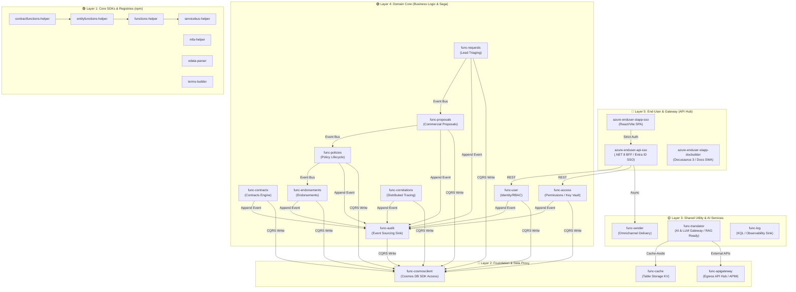
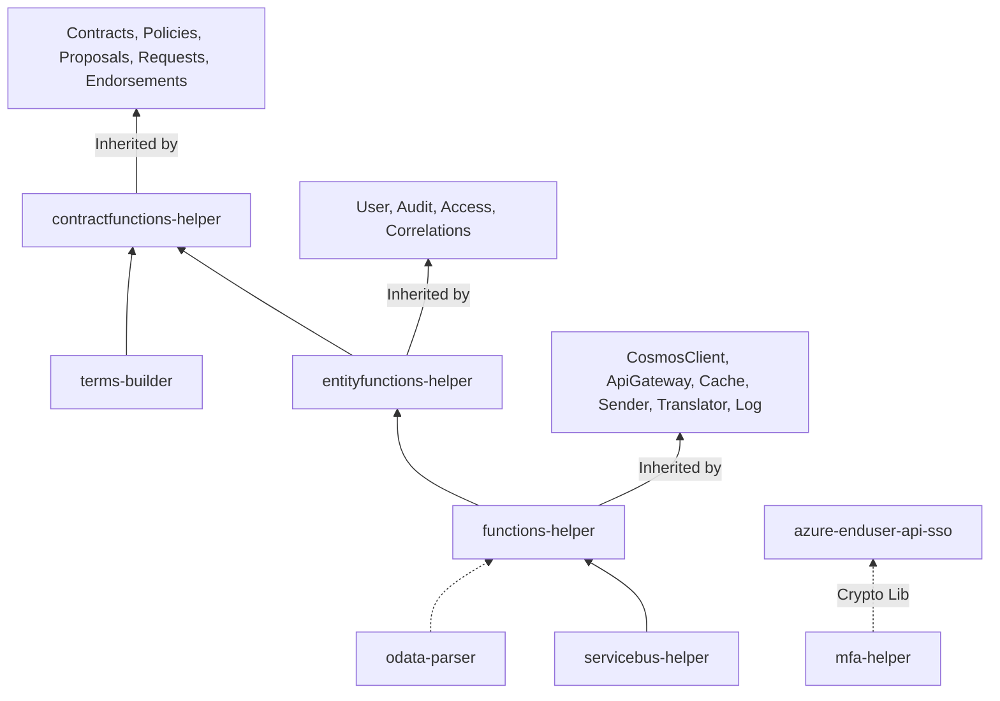
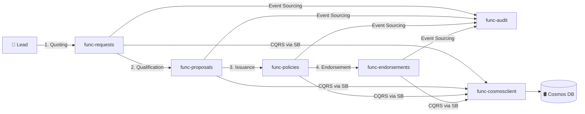

# 🏗️ Enterprise Orchestration Platform & AI Hub — Azure Ecosystem

This document details the **30 repositories** comprising the enterprise ecosystem. It outlines the macro architectural view, dependency graphs, and the precise functionality of each microservice. Designed as a **Core Orchestration Platform**, this architecture adheres to strict **CQRS**, **Event-Driven**, and **Zero-Trust** patterns, providing a highly scalable API Hub ready for modern **AI Agent (MCP/RAG)** integrations.

---

## 📐 Architecture Overview: Global API & Service Topology

---

## 🔗 Package Dependency Graph

---

## 🔄 Business Flow: Async Saga & State Management

**Pipeline Resilience:** HTTP ingress instantly returns `202 Accepted` with correlation IDs. Processing is offloaded to Service Bus queues, guaranteeing zero payload drops during traffic spikes.

---

## 📊 Project Inventory (30 Repositories)

### 🟢 Domain Functions (Business Logic Core)

| Project             | Responsibility                         | Framework / Role            | Service Bus Queues                   |
| ------------------- | -------------------------------------- | --------------------------- | ------------------------------------ |
| `func-access`       | Granular RBAC Permissions & App Scopes | Node.js / EntityFunctions   | `environment*`, `system*`, `access*` |
| `func-audit`        | Centralized Event Sourcing Sink        | Node.js / CQRS Terminal     | `audit` (single ingress)             |
| `func-contracts`    | Core Contracts Engine + Rules          | Node.js / ContractFunctions | `contracts*`                         |
| `func-correlations` | Cross-reference mappings               | Node.js / EntityFunctions   | `correlations*`                      |
| `func-endorsements` | Mid-term Policy Adjustments            | Node.js / ContractFunctions | `endorsements*`                      |
| `func-policies`     | Policy Lifecycle & Issuance            | Node.js / ContractFunctions | `policies*`                          |
| `func-proposals`    | Pre-issuance commercial proposals      | Node.js / ContractFunctions | `proposals*`                         |
| `func-requests`     | Quote Requests & Lead Triaging         | Node.js / ContractFunctions | `requests*`                          |
| `func-user`         | Identity / Entra ID Mapping            | Node.js / EntityFunctions   | `user*`                              |
| `func-template`     | Boilerplate for new microservices      | Node.js / Scaffolding       | —                                    |

### 🔷 Foundation Functions (Infrastructure Proxies)

| Project             | Responsibility                             | Key Integrations                  |
| ------------------- | ------------------------------------------ | --------------------------------- |
| `func-cosmosclient` | Centralized Data Access Layer (CQRS Write) | `@azure/cosmos`, Managed Identity |
| `func-apigateway`   | Outbound HTTP Proxy (Egress API Hub)       | API Lifecycle, Retries/Polly      |
| `func-cache`        | Distributed KV Cache (TTL Enforcement)     | `@azure/data-tables`              |

### 🟡 Shared Services (Utilities & AI Automation)

| Project           | Responsibility                 | Integration Target            |
| ----------------- | ------------------------------ | ----------------------------- |
| `func-sender`     | Omnichannel Notification Hub   | Azure Communication Services  |
| `func-translator` | **AI Gateway / LLM Proxy**     | LLMOps, Cache-Aside AI Engine |
| `func-log`        | Centralized Observability Sink | Datadog / KQL Log Analytics   |

### 🟣 Core Libraries & SDKs (npm Packages)

| npm Package                | Role & Features                                                               |
| -------------------------- | ----------------------------------------------------------------------------- |
| `functions-helper`         | Durable Functions abstractions, Request-Reply async pattern over Service Bus. |
| `entityfunctions-helper`   | Factory generating Type-Safe CRUD pipelines (Zod + ETag concurrency).         |
| `contractfunctions-helper` | Injects dynamic regulatory Rules Engines into domain operations.              |
| `servicebus-helper`        | SDK wrapper abstracting connections, batching, and DLQ management.            |
| `mfa-helper`               | Crypto library (SHA-512, `timingSafeEqual`) for zero-dependency MFA.          |
| `odata-parser`             | Translates OData `$filter` into sanitized Cosmos DB SQL (Injection-safe).     |
| `terms-builder`            | Central Schema Registry for dynamic business validation (Strict Typing).      |

### 🔵 End-User Applications (Presentation & Gateways)

| Project            | Role & Features                                                                |
| ------------------ | ------------------------------------------------------------------------------ |
| `api-sso`          | **.NET 8 BFF Gateway**: Orchestrates SSO (Azure Entra ID) and downstream APIs. |
| `stapp-docbuilder` | Compiles interactive architectures (Docusaurus 3) from scattered READMEs.      |
| `stapp-sso`        | React 18 / Vite SPA for Authentication. Strict TypeScript and ARIA roles.      |

---

## 📋 Architectural Deep-Dive: Key Components

### 1. `azure-enduser-api-sso` (.NET 8 API Hub)

- **Description:** Backend-For-Frontend (BFF) built in **C# / .NET 8**. It serves as the primary ingress Gateway, brokering communication between external frontends and the internal microservice mesh.
- **Security & IAM:** Deep integration with **Azure Entra ID (Active Directory)** and **Managed Identities**. Interacts with Azure Key Vault for secure secret retrieval.
- **API Lifecycle:** Implements robust resilience patterns (Circuit Breakers via Polly) and standardizes API lifecycle management before hitting downstream Serverless functions.

### 2. `azure-shared-func-translator` (AI Agent & LLMOps Hub)

- **Description:** Intelligent proxy designed for AI model interactions and Prompt Engineering.
- **AI Readiness:** Serves as the blueprint for integrating **Model Context Protocol (MCP)** servers. It bridges the gap between raw backend data and LLMs, providing contextual retrieval mechanisms suitable for **RAG (Retrieval-Augmented Generation)** architectures.
- **Performance:** Employs a sophisticated Cache-Aside pattern via `func-cache` to drastically reduce token costs and latency for repetitive LLM queries.

### 3. `azure-foundation-func-apigateway` (Egress API Hub)

- **Description:** Centralized Egress Gateway controlling all outbound traffic to 3rd-party platforms.
- **Responsibility:** Standardizes authentication, payload serialization, and observability headers. Ensures that any integration with external AI Agents or external APIM instances (like Azure APIM) runs through a single, auditable chokepoint.

### 4. Custom Package Architecture (`-helper` Ecosystem)

- **Description:** A suite of internal libraries enforcing **100% Type-Safety** and architectural standards.
- **Highlights:** \* `entityfunctions-helper` dynamically spins up Durable Orchestrators.
- `servicebus-helper` auto-handles transient faults and exponential backoffs.
- `terms-builder` utilizes Zod for runtime schema validation, entirely mitigating `NullReferenceExceptions` and malformed payloads at the edge.

### 5. `project-utils` (CI/CD & DevOps Automation)

- **Description:** Centralized scripting hub acting as a local twin for our **GitHub Actions / OpenShift** deployment pipelines.
- **Capabilities:** Automates cascading dependency resolution (`npm-cleanup-reinstall.ps1`), strict linting enforcement (`npm-lint-all.ps1`), and batch commits orchestrating up to 25 parallel containerized pipeline deployments.

---

## 🛡️ Applied Enterprise Patterns

| Architecture Pattern    | Implementation Detail                                                                                        |
| ----------------------- | ------------------------------------------------------------------------------------------------------------ |
| **Event-Driven / Saga** | Cross-domain workflows managed entirely asynchronously via Azure Service Bus.                                |
| **CQRS**                | Read/Write segregation. Complex state mutations are decoupled from database commits via `func-cosmosclient`. |
| **Event Sourcing**      | `func-audit` records immutable state deltas, ensuring 100% compliance traceability.                          |
| **BFF / API Hub**       | `.NET 8 api-sso` aggregates downstream data, translating internal domain context to client-facing APIs.      |
| **Cache-Aside**         | AI translation mechanisms leveraging Table Storage to optimize external LLM API costs.                       |

---

## 🚀 Technology Stack Alignment

| Capability          | Technologies Utilized                                                     |
| ------------------- | ------------------------------------------------------------------------- |
| **API & Backend**   | **.NET 8 (C#)**, Node.js 22+, Azure Functions v4 (Durable Task Framework) |
| **Frontend**        | React 18, Vite, TypeScript (Strict-Mode), Angular (Compatibility Layer)   |
| **Messaging & DB**  | Azure Service Bus, Cosmos DB (NoSQL), Azure Table Storage                 |
| **Security**        | Azure Entra ID, ADFS, Managed Identities, Azure Key Vault, Native Crypto  |
| **AI Integrations** | Python/Node.js MCP ready pipelines, RAG context builders, Azure AI        |
| **CI/CD & Infra**   | GitHub Actions, Docker, Helm / OpenShift (Target deploy), Log Analytics   |
